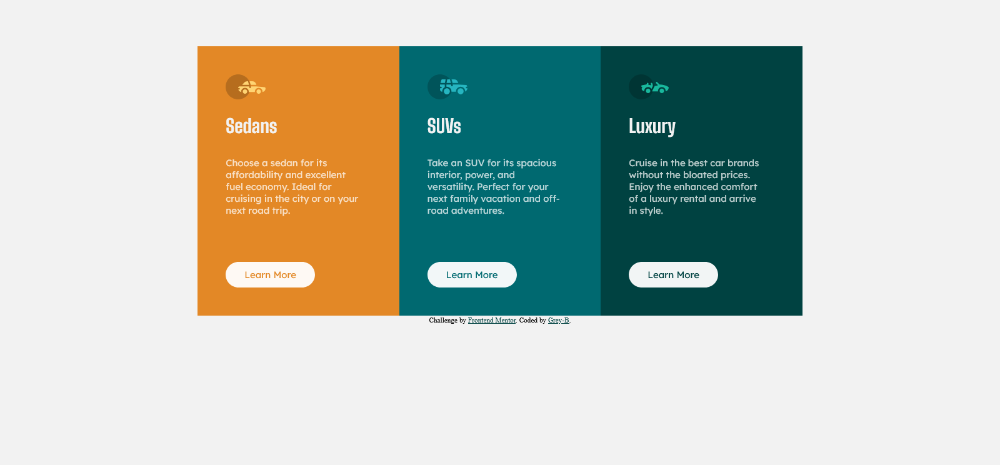

# Frontend Mentor - 3 Column Card Solution

This is my solution to the [3-column preview card component on Frontend Mentor](https://www.frontendmentor.io/challenges/3column-preview-card-component-pH92eAR2-). Thank you Frontend Mentor for the opportunity to cultivate my skill.

## Table of contents

- [Overview](#overview)
  - [The challenge](#the-challenge)
  - [Screenshot](#screenshot)
  - [Links](#links)
- [My process](#my-process)
  - [What I'm proud of](#what-im-proud-of)
  - [What I would do differently](#what-i-would-do-differently)
  - [What challenges I faced](#what-challenges-i-faced)
  - [What I would like help with](#what-i-would-like-help-with)
- [Author](#author)

## Overview

### Screenshot

### Links

- Solution URL: [Github repository](https://github.com/gab-souza-martins/3-column-card)
- Live Site URL: [Github pages](https://gab-souza-martins.github.io/3-column-card/)

## My process

### What I'm proud of
I'm proud of being able to complete this challenge rather quickly. Though it took some time for me to upload it, I completed the challenge in just a few hours of work. Hopefully I can keep this pace up going forward.

### What I would do differently
For this challenge, I went with a mobile-first approach, as opposed to the desktop-first one of my previous challenge. However, I still had some of the same difficulties, so I'm wondering if there is a way to combine both approaches. I'll have to look that up.

### What challenges I faced
Flexbox was something I had some problem with, as it's a new concept to me, but I suppose it's something I'll just need to get experience with through trial and error.

Other challenges I faced were with the border radius and vertical alignment, as I'll detail on the next section.

### What I would like help with
I would like help with both border radius and vertical alignment. The latter seems the easiest of them, however I still had trouble finding some kind of solution that worked with the actual grid as a whole, instead of just the elements inside it. 

As for the former, I could not find any way to make the flexbox's border look rounded the way I wanted. It either slanted horizontally or vertically, broke in different screensizes, or had a point instead of a smooth roundness. Often it was a mix of all of these problems. If anyone knows how to make good rounded borders easily, please let me know.

## Author

- Github - [Gabriel de Souza](https://github.com/gab-souza-martins)
- Frontend Mentor - [Gabriel de Souza](https://www.frontendmentor.io/profile/gab-souza-martins)
